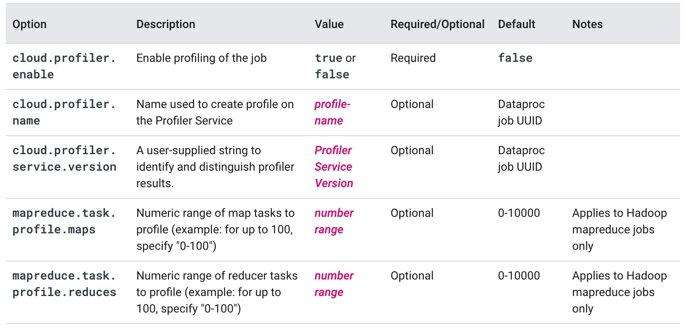

layout: true

.signature[@algogrit]

---

class: center, middle

# GCP Dataproc

Gaurav Agarwal

---
class: center, middle

Dataproc is a managed Spark and Hadoop service that lets you take advantage of open source data tools for batch processing, querying, streaming, and machine learning.

---
class: center, middle

Dataproc automation helps you create clusters quickly, manage them easily, and save money by turning clusters off when you don't need them.

---

## Why use Dataproc?

- Low cost

- Super fast

- Integrated

- Managed

- Simple and familiar

---
class: center, middle

## What is included in Dataproc?

---
class: center, middle

When you create a cluster, standard Apache Hadoop ecosystem components are automatically installed on the cluster.

---
class: center, middle

[List](https://cloud.google.com/dataproc/docs/concepts/versioning/dataproc-release-2.0) of open source (Hadoop, Spark, Hive, and Pig) and Google Cloud Platform connector versions supported

---
class: center, middle

You can install additional components, called "optional components" on the cluster when you create the cluster.

---
class: center, middle


.image-credits[https://cloud.google.com/dataproc/docs/concepts/components/overview]

---
class: center, middle

## Managing clusters

---
class: center, middle

`gcloud dataproc clusters ...`

---
class: center, middle

### Cluster configuration

---

- HA, Single Master, Single Node

- Master/Worker Types

- Optional Components

- Image

---
class: center, middle

Listing the nodes

```bash
gcloud compute instances list
```

---
class: center, middle

*Demo*: Accessing hadoop and spark within the cluster nodes

---
class: center, middle

## Component Gateway for accessing through UI

`--enable-component-gateway`

---
class: center, middle

*Demo*: Accessing the UI using proxy ssh

---
class: center, middle

## Creating a image

.content-credits[https://cloud.google.com/dataproc/docs/guides/dataproc-images]

---
class: center, middle

## Creating and managing labels

.content-credits[https://cloud.google.com/dataproc/docs/guides/creating-managing-labels]

---
class: center, middle

Apply user labels to Dataproc cluster and job resources in order to group resources and related operations for later filtering and listing.

---
class: center, middle

*Applying*

```bash
gcloud dataproc clusters create {args} --labels env=prod,customer=acme
gcloud dataproc jobs submit {args} --labels env=prod,customer=acme
```

---
class: center, middle

*Filtering*

```bash
gcloud dataproc clusters list \
    --region=region \
    --filter="status.state=ACTIVE AND labels.env=prod"
gcloud dataproc jobs list \
    --region=region \
    --filter="status.state=ACTIVE AND labels.customer=acme"
```

---

### Automatically applied labels


.image-credits[https://cloud.google.com/dataproc/docs/guides/creating-managing-labels#automatically_applied_labels]

---
class: center, middle

## Submitting jobs

---
class: center, middle

*Demo*: Scheduling our first Java based spark job

---
class: center, middle

*Demo*: Scheduling our first Python based spark job

---
class: center, middle

### Life of a Dataproc Job

.content-credits[https://cloud.google.com/dataproc/docs/concepts/jobs/life-of-a-job]

---

`1.` User submits job to Dataproc.

  - JobStatus.State is marked as `PENDING`.

`2.` Job waits to be acquired by the `dataproc` agent.

  - If the job is acquired, JobStatus.State is marked as `RUNNING`.

  - If the job is not acquired due to agent failure, Compute Engine network failure, or other cause, the job is marked `ERROR`.

`3.` Once a job is acquired by the agent, the agent verifies that there are sufficient resources available on the Dataproc cluster's master node to start the driver.

  - If sufficient resources are not available, the job is delayed (throttled). JobStatus.Substate shows the job as `QUEUED`, and Job.JobStatus.details provides information on the cause of the delay.

  - If sufficient resources are available, the `dataproc` agent starts the job driver process.

---

`4.` At this stage, typically there are one or more applications running in Apache Hadoop YARN. However, Yarn applications may not start until the driver finishes scanning Cloud Storage directories or performing other start-up job tasks.

`5.` The `dataproc` agent periodically sends updates to Dataproc on job progress, cluster metrics, and Yarn applications associated with the job.

`6.` Yarn application(s) complete.

  - Job continues to be reported as `RUNNING` while driver performs any job completion tasks, such as materializing collections.

  - An unhandled or uncaught failure in the Main thread can leave the driver in a zombie state (marked as `RUNNING` without information as to the cause of the failure).

`7.` Driver exits. `dataproc` agent reports completion to Dataproc.

  - Dataproc reports job as `DONE`.

---
class: center, middle

### Managing a job

`gcloud dataproc jobs ...`

---
class: center, middle

### Job concurrency

---
class: center, middle

*Formula*

`max((masterMemoryMb - 3584) / masterMemoryMbPerJob, 5)`

---
class: center, middle

`masterMemoryMbPerJob` is 1024 by default

---

- `--max-concurrent-jobs`

- `--driver-size-mb`

---
class: center, middle

### Restartable Jobs

.content-credits[https://cloud.google.com/dataproc/docs/concepts/jobs/restartable-jobs]

---
class: center, middle

Dataproc jobs will not automatically restart on failure.

---

- A job is reported successful if the driver terminates with code 0.

- A job is reported failed if:

  - The driver terminates with a non-zero code more than 4 times in 10 minutes.

  - The driver terminates with a non-zero code, and has exceeded the `max_failures_per_hour` or the `max_failures_total` setting.

- A job will be restarted if the driver exits with a non-zero code, is not thrashing, and is within the `max_failures_per_hour` and `max_failures_total` settings.

---
class: center, middle

### Job design considerations

---

- Design your jobs to gracefully handle restarting. For example, if your job writes to a directory, your job accommodate the possibility that the directory will exist when the job is restarted.

- Apache Spark streaming jobs that checkpoint can be restarted after failure, but they will not report Yarn status.

---
class: center, middle

*Challenge*: [Submit a job onto a dataproc cluster](https://github.com/AgarwalConsulting/gcp-training/blob/master/challenges/dataproc/1-create-cluster-and-manage-job.md)

---
class: center, middle

### Reading logs

---
class: center, middle

```bash
gcloud logging read \
    "resource.type=cloud_dataproc_job \
    resource.labels.region=cluster-region \
    resource.labels.job_id=my-job-id"
```

---
class: center, middle

### Logging - Job driver output

.content-credits[https://cloud.google.com/dataproc/docs/guides/driver-output]

---
class: center, middle

`gcloud dataproc jobs wait ...`

---
class: center, middle

`--driver-log-levels`

---
class: center, middle

### Manage Java and Scala dependencies for Apache Spark

.content-credits[https://cloud.google.com/dataproc/docs/guides/manage-spark-dependencies]

---
class: center, middle

Spark applications often depend on third-party Java or Scala libraries.

---
class: center, middle

`--properties=spark.jars.packages=[DEPENDENCIES]`

---
class: center,middle

#### Avoiding dependency conflicts

---
class: center, middle

Spark application dependencies can conflict with Hadoop's dependencies

---

- Conflict can arise because Hadoop injects its dependencies into the application's classpath, so its dependencies take precedence over the application's dependencies.

- When a conflict occurs, `NoSuchMethodError` or other errors can be generated.

---
class: center, middle

*Solution*: Create a Shaded uber-JAR

---

- Create a single JAR that contains the application's package and all of its dependencies.

- Relocate the conflicting dependency packages within the uber JAR to prevent their path names from conflicting with those of Hadoop's dependency packages.

- Instead of modifying your code, use a plugin to automatically perform this relocation (aka "shading") as part of the packaging process.

---
class: center, middle

### Profiling

.content-credits[https://cloud.google.com/dataproc/docs/guides/profiling]

---
class: center, middle

```bash
--properties \
  cloud.profiler.enable=true,cloud.profiler.name=profiler_name,cloud.profiler.service.version=version
```

---
class: center, middle



.image-credits[https://cloud.google.com/dataproc/docs/guides/profiling#submit_a_job_with_options]

---
class: center, middle

## Dataproc Hadoop Data Storage

.content-credits[https://cloud.google.com/dataproc/docs/concepts/dataproc-hdfs]

---
class: center, middle

## Starting and Stopping Clusters

.content-credits[https://cloud.google.com/dataproc/docs/guides/dataproc-start-stop]

---
class: center, middle

Stopping a cluster stops all cluster Compute Engine VMs.

---
class: center, middle

`gcloud dataproc clusters stop/start ...`

---

- You do not pay for these VMs while they are stopped.

- However, you continue to pay for any associated cluster resources, such as persistent disks.

---

- *Running operations*: If a cluster has running operations (such as update or diagnose operations), the stop request will fail.

- *Running jobs*: If a cluster has running jobs, the stop request will succeed, the VMs will stop, and the running jobs will fail.

- *Stop Response*: When the stop request returns a stop operation to the user or caller in the response, the cluster will be in a STOPPING state, and no further jobs will be allowed to be submitted (SubmitJob requests will fail).

- *Autoscaling*: If you stop a cluster that has autoscaling enabled, the Dataproc autoscaler will stop scaling the cluster. It will resume scaling the cluster once it has been started again. If you enable autoscaling on a stopped cluster, the autoscaling policy will only take effect once the cluster has been started.

---

### Limitations

- You cannot stop:

  - clusters with secondary workers

  - clusters with local ssds

  - clusters with Dataproc Personal Cluster Authentication enabled

- After a cluster is stopped, you cannot:

  - update the cluster

  - submit jobs to the cluster

  - access notebooks on the cluster using the Dataproc component gateway

---
class: center, middle

## Setting default region

---
class: center, middle

```bash
gcloud config set dataproc/region $GOOGLE_CLOUD_REGION
```

---
class: center, middle

## Scaling clusters

---

Why scale a Dataproc cluster?

- to increase the number of workers to make a job run faster

- to decrease the number of workers to save money

- to increase the number of nodes to expand available Hadoop Distributed Filesystem (HDFS) storage

---

There are three ways you can scale your Dataproc cluster:

- Use the gcloud command-line tool in the Cloud SDK

- Edit the cluster configuration in the Google Cloud Console

- Use the REST API

---
class: center, middle

### Scaling down with Graceful Decommissioning

---
class: center, middle

Dataproc Graceful Decommissioning incorporates [Graceful Decommission of YARN Nodes](https://hadoop.apache.org/docs/current/hadoop-yarn/hadoop-yarn-site/GracefulDecommission.html) to finish work in progress on a worker before it is removed from the Cloud Dataproc cluster.

---
class: center, middle

`--graceful-decommission-timeout`

---
class: center, middle

### Autoscaling clusters

---
class: center, middle

Estimating the "right" number of cluster workers (nodes) for a workload is difficult, and a single cluster size for an entire pipeline is often not ideal.

---

Use autoscaling

- on clusters that store data in external services, such as Cloud Storage or BigQuery

- on clusters that process many jobs

- to scale up single-job clusters

- with Enhanced Flexibility Mode for Spark batch jobs

---

Autoscaling is **NOT** recommended with/for:

- *HDFS*: Autoscaling is not intended for scaling on-cluster HDFS

  - HDFS utilization is not a signal for autoscaling.

  - HDFS data is only hosted on primary workers. The number of primary workers must be sufficient to host all HDFS data.

  - Decommissioning HDFS DataNodes can delay the removal of workers. Datanodes copy HDFS blocks to other Datanodes before a worker is removed. Depending on data size and the replication factor, this process can take hours.

- *YARN Node Labels*: Autoscaling does not support YARN Node Labels, nor the property dataproc:am.primary_only due to YARN-9088. YARN incorrectly reports cluster metrics when node labels are used.

---

Autoscaling is **NOT** recommended with/for:

- *Spark Structured Streaming*: Autoscaling does not support Spark Structured Streaming.

- *Idle Clusters*: Autoscaling is not recommended for the purpose of scaling a cluster down to minimum size when the cluster is idle. Since creating a new cluster is as fast as resizing one, consider deleting idle clusters and recreating them instead. The following tools support this "ephemeral" model:

  - Use Dataproc Workflows to schedule a set of jobs on a dedicated cluster, and then delete the cluster when the jobs are finished. For more advanced orchestration, use Cloud Composer, which is based on Apache Airflow.

  - For clusters that process ad-hoc queries or externally scheduled workloads, use Cluster Scheduled Deletion to delete the cluster after a specified idle period or duration, or at a specific time.

---

To enable autoscaling on a cluster:

1. Create an autoscaling policy.

2. Either:

  a. Create an autoscaling cluster, or

  b. Enable autoscaling on an existing cluster.

---
class: center, middle

```bash
gcloud dataproc autoscaling-policies import ...
```

---
class: center, middle

#### Defining and applying an autoscaling policy

.content-credits[https://cloud.google.com/dataproc/docs/reference/rest/v1/projects.locations.autoscalingPolicies]

---
class: center, middle

```bash
gcloud dataproc autoscaling-policies import simple-policy
  --source=examples/dataproc/as-policy/simple.yaml \
  --region=$GOOGLE_CLOUD_REGION
```

---
class: center, middle

`--autoscaling-policy=policy`

---
class: center, middle

You can update a policy that is being used. The updates immediately affect the autoscaling behavior for all clusters that use the policy.

---
class: center, middle

#### How autoscaling works

.content-credits[https://cloud.google.com/dataproc/docs/concepts/configuring-clusters/autoscaling#how_autoscaling_works]

---
class: center, middle

#### Autoscaling configuration recommendations

.content-credits[https://cloud.google.com/dataproc/docs/concepts/configuring-clusters/autoscaling#autoscaling_configuration_recommendations]

---

- Avoid scaling primary workers

  - Primary workers run HDFS Datanodes

- Use [Enhanced Flexibility Mode](https://cloud.google.com/dataproc/docs/concepts/configuring-clusters/flex) for Spark batch jobs

  - `dataproc:efm.spark.shuffle`

- Choosing a graceful decommissioning timeout

  - graceful decommissioning timeout should be set to a value longer than the longest job a cluster will process.

- Setting `scaleUpFactor`

  - A good starting point is 0.05 for MapReduce jobs and Spark jobs with dynamic allocation enabled.

- Setting `scaleDownFactor`

  - Set this value to 0.0 to avoid ever scaling down the cluster (for ephemeral clusters)

---

- Picking a cooldown period

  - The recommended practice is to set a policy's `scaleUpMinWorkerFraction` and `scaleDownMinWorkerFraction` to a non-zero value when using a shorter `cooldownPeriod`

- Worker count bounds and group weights

  - Each worker group has `minInstances` and `maxInstances` that configure a hard limit on the size of each group.

  - Weight can almost always be left at the default 1.

---
class: center, middle

## Connectors

---
class: center, middle

### Cloud Storage connector

---
class: center, middle

The Cloud Storage connector is an [open source Java library](https://github.com/GoogleCloudDataproc/hadoop-connectors/tree/master/gcs) that lets you run Apache Hadoop or Apache Spark jobs directly on data in Cloud Storage, and offers a number of benefits over choosing the Hadoop Distributed File System (HDFS).

---
class: center, middle

Choosing Cloud Storage alongside the Hadoop Distributed File System (HDFS) has several benefits.

.content-credits[https://cloud.google.com/dataproc/docs/concepts/connectors/cloud-storage#benefits_of_the_connector]

---

- *Direct data access* - Store your data in Cloud Storage and access it directly, with no need to transfer it into HDFS first.

- *HDFS compatibility* - You can store data in HDFS in addition to Cloud Storage, and access it with the connector by using a different file path.

- *Interoperability* - Storing data in Cloud Storage enables seamless interoperability between Spark, Hadoop, and other Google services.

- *Data accessibility* - When you shut down a Hadoop cluster, you still have access to your data in Cloud Storage, unlike HDFS.

- *High data availability* - Data stored in Cloud Storage is highly available and globally replicated without a performance hit.

- *No storage management overhead* - Unlike HDFS, Cloud Storage requires no routine maintenance such as checking the file system, upgrading or rolling back to a previous version of the file system, etc.

- *Quick startup* - In HDFS, a MapReduce job can't start until the NameNode is out of safe mode—a process that can take from a few seconds to many minutes depending on the size and state of your data. With Google Cloud Storage, you can start your job as soon as the task nodes start, leading to significant cost savings over time.

---
class: center, middle

The Cloud Storage connector is installed by default on all Dataproc cluster nodes under `/usr/local/share/google/dataproc/lib/` directory.

---

If your application depends a connector version that is different from the default connector version deployed on your Dataproc cluster, you must either:

- create a new cluster with the `--metadata GCS_CONNECTOR_VERSION=x.y.z` flag, which will update the connector used by your application to the specified connector version, or

- include and relocate the connector classes and connector dependencies for the version you are using into your application's jar so that the connector version you are using will not conflict with the connector version deployed on your Dataproc cluster.

---

#### Using the GCS connector

There are multiple ways to access data stored in Cloud Storage:

- In a Spark (or PySpark) or Hadoop application using the `gs://` prefix

- The hadoop shell: `hadoop fs -ls gs://bucket/dir/file`

or

- Programmatically. The Cloud Storage connector requires Java 8:

```xml
<dependency>
    <groupId>com.google.cloud.bigdataoss</groupId>
    <artifactId>gcs-connector</artifactId>
    <version>{insert "hadoopX-X.X.X" connector version number here}</version>
    <scope>provided</scope>
    <classifier>shaded</classifier>
</dependency>
```

---
class: center, middle

### BigQuery connector

---
class: center, middle

The BigQuery connector is a library that enables Spark and Hadoop applications to process data from BigQuery and write data to BigQuery using its native terminology.

---
class: center, middle

You can use a BigQuery connector to enable programmatic read/write access to BigQuery

---

The following BigQuery connectors are available for use in the Hadoop eco-system:

- [The Spark BigQuery Connector](https://github.com/GoogleCloudDataproc/spark-bigquery-connector) adds a Spark data source, which allows DataFrames to interact directly with BigQuery tables using familiar read and write operations.

- [The Hadoop BigQuery Connector](https://github.com/GoogleCloudDataproc/hadoop-connectors) allows Hadoop mappers and reducers to interact with BigQuery tables using abstracted versions of the InputFormat and OutputFormat classes.

---

Add the connector at runtime using the `--jars` parameter, which can be used with the Dataproc API or `spark-submit`

- If you are using Dataproc image 1.5 and above, add the following parameter:

  - `--jars=gs://spark-lib/bigquery/spark-bigquery-latest_2.12.jar`

- If you are using Dataproc image 1.4 or below, add the following parameter:

  - `--jars=gs://spark-lib/bigquery/spark-bigquery-latest.jar`

---
class: center, middle

*Demo*: [Running spark job with a BQ connector](https://github.com/AgarwalConsulting/gcp-training/tree/master/examples/dataproc/demos/spark-bq.md)

---
class: center, middle

*Code Walkthrough*: [MapReduce job for BigQuery](https://github.com/AgarwalConsulting/gcp-training/tree/master/examples/dataproc/WordCount.java)

.content-credits[https://cloud.google.com/dataproc/docs/tutorials/bigquery-connector-mapreduce-example]

---

`GsonBigQueryInputFormat` provides Hadoop with the BigQuery objects in a JsonObject format via the following primary operations:

- Using a user-specified query to select BigQuery objects

- Splitting the results of the query evenly among Hadoop nodes

- Parsing the splits into Java objects to pass to the Mapper. The Hadoop Mapper class receives a JsonObject representation of each selected BigQuery object.

---

The `BigQueryInputFormat` class provides access to BigQuery records through an extension of the Hadoop InputFormat class. To use the `BigQueryInputFormat` class:

- Lines must be added to the main Hadoop job to set parameters in the Hadoop configuration.

- The InputFormat class must be set to `GsonBigQueryInputFormat`.

---
class: center, middle

`IndirectBigQueryOutputFormat` class provides Hadoop with the ability to write JsonObject values directly into a BigQuery table.

---
class: center, middle

```bash
--jars=gs://hadoop-lib/bigquery/bigquery-connector-hadoop2-latest.jar
```

---
class: center, middle

#### Using Apache Hive on Dataproc

.content-credits[https://cloud.google.com/architecture/using-apache-hive-on-cloud-dataproc]

---
class: center, middle

### Pub/Sub Lite Connector

---
class: center, middle

The Pub/Sub Lite Spark Connector supports Pub/Sub Lite as an input source to Apache Spark Structured Streaming in the default micro-batch processing and experimental continuous processing modes.

---
class: center, middle

Code
https://github.com/algogrit/presentation-gcp-dataproc

Slides
https://gcp-dataproc.slides.agarwalconsulting.io
