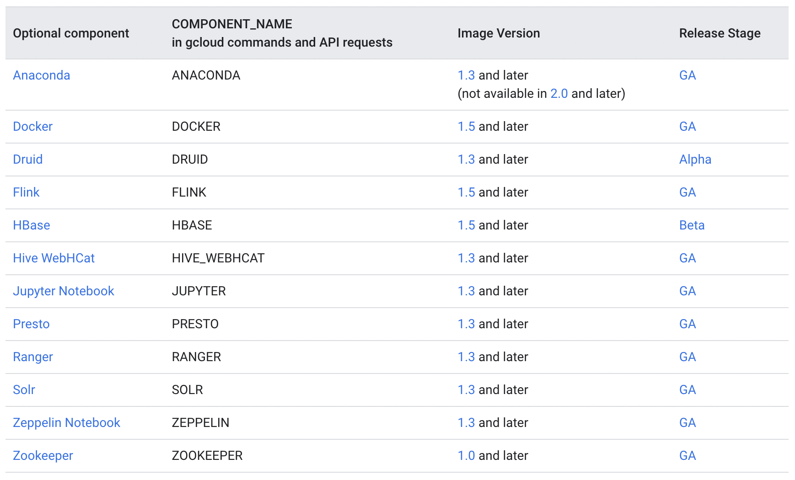
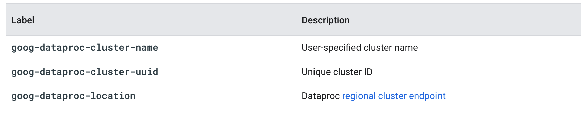

layout: true

.signature[@algogrit]

---

class: center, middle

# GCP Dataproc

Gaurav Agarwal

---
class: center, middle

Dataproc is a managed Spark and Hadoop service that lets you take advantage of open source data tools for batch processing, querying, streaming, and machine learning.

---
class: center, middle

Dataproc automation helps you create clusters quickly, manage them easily, and save money by turning clusters off when you don't need them.

---

## Why use Dataproc?

- Low cost

- Super fast

- Integrated

- Managed

- Simple and familiar

---
class: center, middle

## What is included in Dataproc?

---
class: center, middle

When you create a cluster, standard Apache Hadoop ecosystem components are automatically installed on the cluster.

---
class: center, middle

[List](https://cloud.google.com/dataproc/docs/concepts/versioning/dataproc-release-2.0) of open source (Hadoop, Spark, Hive, and Pig) and Google Cloud Platform connector versions supported

---
class: center, middle

You can install additional components, called "optional components" on the cluster when you create the cluster.

---
class: center, middle



.image-credits[https://cloud.google.com/dataproc/docs/concepts/components/overview]

---
class: center, middle

## Managing clusters

---
class: center, middle

`gcloud dataproc clusters ...`

---
class: center, middle

### Cluster configuration

---

- HA, Single Master, Single Node

- Master/Worker Types

- Optional Components

- Image

---
class: center, middle

Listing the nodes

```bash
gcloud compute instances list
```

---
class: center, middle

*Demo*: Accessing hadoop and spark within the cluster nodes

---
class: center, middle

## Component Gateway for accessing through UI

`--enable-component-gateway`

---
class: center, middle

*Demo*: Accessing the UI using proxy ssh

---
class: center, middle

## Creating a image

.content-credits[https://cloud.google.com/dataproc/docs/guides/dataproc-images]

---
class: center, middle

## Creating and managing labels

.content-credits[https://cloud.google.com/dataproc/docs/guides/creating-managing-labels]

---
class: center, middle

Apply user labels to Dataproc cluster and job resources in order to group resources and related operations for later filtering and listing.

---
class: center, middle

*Applying*

```bash
gcloud dataproc clusters create {args} --labels env=prod,customer=acme
gcloud dataproc jobs submit {args} --labels env=prod,customer=acme
```

---
class: center, middle

*Filtering*

```bash
gcloud dataproc clusters list \
    --region=region \
    --filter="status.state=ACTIVE AND labels.env=prod"
gcloud dataproc jobs list \
    --region=region \
    --filter="status.state=ACTIVE AND labels.customer=acme"
```

---

### Automatically applied labels



.image-credits[https://cloud.google.com/dataproc/docs/guides/creating-managing-labels#automatically_applied_labels]

---
class: center, middle

## Submitting jobs

---
class: center, middle

*Demo*: Scheduling our first Java based spark job

---
class: center, middle

*Demo*: Scheduling our first Python based spark job

---
class: center, middle

### Life of a Dataproc Job

.content-credits[https://cloud.google.com/dataproc/docs/concepts/jobs/life-of-a-job]

---

`1.` User submits job to Dataproc.

  - JobStatus.State is marked as `PENDING`.

`2.` Job waits to be acquired by the `dataproc` agent.

  - If the job is acquired, JobStatus.State is marked as `RUNNING`.

  - If the job is not acquired due to agent failure, Compute Engine network failure, or other cause, the job is marked `ERROR`.

`3.` Once a job is acquired by the agent, the agent verifies that there are sufficient resources available on the Dataproc cluster's master node to start the driver.

  - If sufficient resources are not available, the job is delayed (throttled). JobStatus.Substate shows the job as `QUEUED`, and Job.JobStatus.details provides information on the cause of the delay.

  - If sufficient resources are available, the `dataproc` agent starts the job driver process.

---

`4.` At this stage, typically there are one or more applications running in Apache Hadoop YARN. However, Yarn applications may not start until the driver finishes scanning Cloud Storage directories or performing other start-up job tasks.

`5.` The `dataproc` agent periodically sends updates to Dataproc on job progress, cluster metrics, and Yarn applications associated with the job.

`6.` Yarn application(s) complete.

  - Job continues to be reported as `RUNNING` while driver performs any job completion tasks, such as materializing collections.

  - An unhandled or uncaught failure in the Main thread can leave the driver in a zombie state (marked as `RUNNING` without information as to the cause of the failure).

`7.` Driver exits. `dataproc` agent reports completion to Dataproc.

  - Dataproc reports job as `DONE`.

---
class: center, middle

### Managing a job

`gcloud dataproc jobs ...`

---
class: center, middle

### Job concurrency

---
class: center, middle

*Formula*

`max((masterMemoryMb - 3584) / masterMemoryMbPerJob, 5)`

---
class: center, middle

`masterMemoryMbPerJob` is 1024 by default

---

- `--max-concurrent-jobs`

- `--driver-size-mb`

---
class: center, middle

### Restartable Jobs

.content-credits[https://cloud.google.com/dataproc/docs/concepts/jobs/restartable-jobs]

---
class: center, middle

Dataproc jobs will not automatically restart on failure.

---

- A job is reported successful if the driver terminates with code 0.

- A job is reported failed if:

  - The driver terminates with a non-zero code more than 4 times in 10 minutes.

  - The driver terminates with a non-zero code, and has exceeded the `max_failures_per_hour` or the `max_failures_total` setting.

- A job will be restarted if the driver exits with a non-zero code, is not thrashing, and is within the `max_failures_per_hour` and `max_failures_total` settings.

---
class: center, middle

### Job design considerations

---

- Design your jobs to gracefully handle restarting. For example, if your job writes to a directory, your job accommodate the possibility that the directory will exist when the job is restarted.

- Apache Spark streaming jobs that checkpoint can be restarted after failure, but they will not report Yarn status.

---
class: center, middle

*Challenge*: [Submit a job onto a dataproc cluster](https://github.com/AgarwalConsulting/gcp-training/blob/master/challenges/dataproc/1-create-cluster-and-manage-job.md)

---
class: center, middle

### Job driver output

.content-credits[https://cloud.google.com/dataproc/docs/guides/driver-output]

---
class: center, middle

`gcloud dataproc jobs wait ...`

---
class: center, middle

`--driver-log-levels`

---
class: center, middle

### Manage Java and Scala dependencies for Apache Spark

.content-credits[https://cloud.google.com/dataproc/docs/guides/manage-spark-dependencies]

---
class: center, middle

Spark applications often depend on third-party Java or Scala libraries.

---
class: center, middle

`--properties=spark.jars.packages=[DEPENDENCIES]`

---
class: center,middle

#### Avoiding dependency conflicts

---
class: center, middle

Spark application dependencies can conflict with Hadoop's dependencies

---

- Conflict can arise because Hadoop injects its dependencies into the application's classpath, so its dependencies take precedence over the application's dependencies.

- When a conflict occurs, `NoSuchMethodError` or other errors can be generated.

--
class: center, middle

*Solution*: Create a Shaded uber-JAR

---

- Create a single JAR that contains the application's package and all of its dependencies.

- Relocate the conflicting dependency packages within the uber JAR to prevent their path names from conflicting with those of Hadoop's dependency packages.

- Instead of modifying your code, use a plugin to automatically perform this relocation (aka "shading") as part of the packaging process.

---
class: center, middle

## Starting and Stopping Clusters

.content-credits[https://cloud.google.com/dataproc/docs/guides/dataproc-start-stop]

---
class: center, middle

Stopping a cluster stops all cluster Compute Engine VMs.

---
class: center, middle

`gcloud dataproc clusters stop/start ...`

---

- You do not pay for these VMs while they are stopped.

- However, you continue to pay for any associated cluster resources, such as persistent disks.

---

- *Running operations*: If a cluster has running operations (such as update or diagnose operations), the stop request will fail.

- *Running jobs*: If a cluster has running jobs, the stop request will succeed, the VMs will stop, and the running jobs will fail.

- *Stop Response*: When the stop request returns a stop operation to the user or caller in the response, the cluster will be in a STOPPING state, and no further jobs will be allowed to be submitted (SubmitJob requests will fail).

- *Autoscaling*: If you stop a cluster that has autoscaling enabled, the Dataproc autoscaler will stop scaling the cluster. It will resume scaling the cluster once it has been started again. If you enable autoscaling on a stopped cluster, the autoscaling policy will only take effect once the cluster has been started.

---

### Limitations

- You cannot stop:

  - clusters with secondary workers

  - clusters with local ssds

  - clusters with Dataproc Personal Cluster Authentication enabled

- After a cluster is stopped, you cannot:

  - update the cluster

  - submit jobs to the cluster

  - access notebooks on the cluster using the Dataproc component gateway

---
class: center, middle

Code
https://github.com/algogrit/presentation-gcp-dataproc

Slides
https://gcp-dataproc.slides.agarwalconsulting.io
